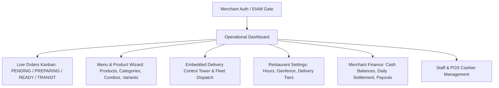

# 07 — MERCHANT WEB COMPLETE RADIOGRAPHY

**Platform:** Web Application (React 18 / TypeScript / Vite / TailwindCSS)  
**Directory:** `merchant-web/`  
**Role Required:** `MERCHANT_ADMIN` / `BRANCH_STAFF` / `STORE_MANAGER`  
**Primary URL:** `/merchant` or custom white-label domain

---

## 🍽️ 1. Functional Architecture & Operating Modules

The Merchant Web Portal is the mission-control application for restaurant and store operators.

---

## 📊 2. Core Functional Centers

1. **Live Orders Kanban (`LiveOrdersModule.tsx`):** Real-time columns for incoming orders. Sound alerts on new `PENDING` orders. One-click transition to `PREPARING` and `READY`.
2. **Fleet Dispatch & Courier Assignment (`CourierAssignModal.tsx`):**
   - Option A: Send to **Global Fleet Pool** (automatic broadcast to couriers).
   - Option B: Assign to **Internal Store Driver** (direct selection from store fleet).
3. **Product & Menu Wizard (`ProductWizard.tsx`):** Multi-step creation of catalog items with image upload to Cloud Storage (`/merchants/{id}/products/`), modifiers, and option groups.
4. **Delivery Control Tower (`DeliveryControlTowerModule.tsx`):** Real-time Leaflet map tracking drivers delivering orders from this merchant.
5. **Restaurant Settings Center (`RestaurantSettingsCenter.tsx`):** Opening/closing hours, delivery radius polygon, base fees, and auto-accept toggles.

---
*Evidence: source code analysis of `merchant-web/src/`.*
