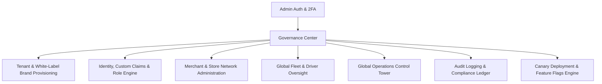

# 09 — ADMIN WEB PANEL COMPLETE RADIOGRAPHY

**Platform:** Admin Web Panel (Enterprise SPA / Modular JS / TailwindCSS)  
**Directory:** `panel-admin/`  
**Role Required:** `PLATFORM_ADMIN` / `SUPER_ADMIN` / `GOVERNANCE_AUDITOR`  
**Primary Entry Point:** `panel-admin/public/index.html` & `dashboard.html`

---

## 🏛️ 1. Functional Architecture & Enterprise Governance

The Admin Panel is the global governance center for the multi-tenant platform.

---

## 🛡️ 2. Core Governance Modules

1. **Governance & Tenant Provisioning (`governanceService.js`):** Creation and lifecycle management of multi-tenant enterprise clients (`/tenants`), quota enforcement, and custom domain mapping.
2. **Identity & Access Management (`identityService.js`):** Synchronizes Firebase Auth Custom Claims (`admin`, `merchant`, `courier`, `tenantId`, `businessId`).
3. **Global Control Tower (`liveOpsTower.js`):** Real-time monitoring of every courier and delivery across all cities and tenants.
4. **Audit & Compliance Ledger (`auditService.js`):** Immutable logging of all sensitive administrative actions (`/audit_events`).
5. **System Health & Canary Gate (`healthService.js`):** Verification of Cloud Functions latencies, Firestore read quotas, and Canary Rollout percentages (`CANARY_PERCENTAGE`).

---
*Evidence: source code analysis of `panel-admin/public/js/`.*
