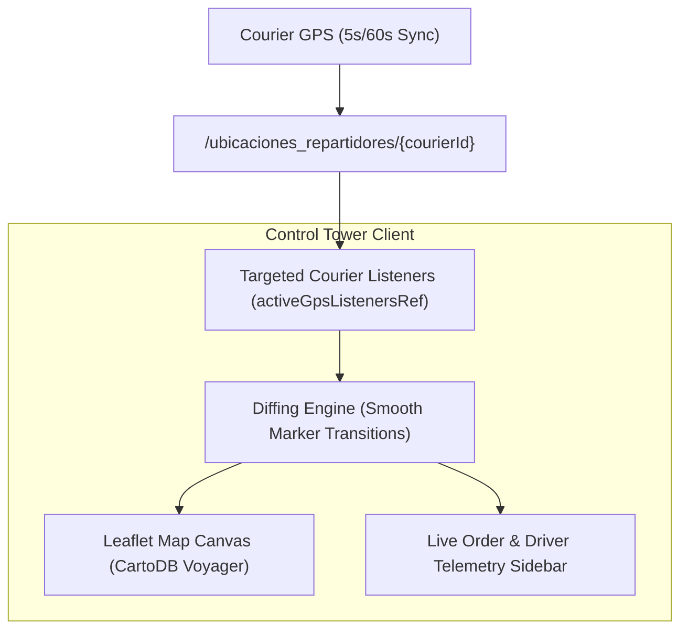

# 11 — CONTROL TOWER COMPLETE RADIOGRAPHY (ADR-013 BASELINE)

**Component:** Merchant & Admin Delivery Control Tower  
**Implementations:**
1. **Merchant Web:** `merchant-web/src/components/DeliveryControlTowerModule.tsx`
2. **Admin Web:** `panel-admin/public/js/dashboard/liveMap.js`
**Cartography Engine:** Leaflet + CartoDB Voyager (`0 Maps Cost Footprint`)  
**Architectural Status:** FROZEN INMUTABLE BASELINE (ADR-013)

---

## 🗺️ 1. Architecture & Zero-Cost Cartography

The Control Tower is the core mission-control map engine for real-time logistics oversight.

---

## 🎯 2. Core Operational Capabilities

1. **Scoped Multi-Tenant Telemetry:** The Merchant Control Tower only subscribes to couriers currently assigned to orders belonging to that specific `businessId` (`activeGpsListenersRef`), eliminating wasteful global listeners.
2. **Marker Differentiation:**
   - **Store Marker (Blue Pin):** Fixed restaurant origin.
   - **Customer Marker (Green Pin):** Destination address.
   - **Courier Marker (Motorcycle Icon):** Dynamic coordinate with heading angle rotation.
3. **Driver Detail Inspection:** Clicking on a courier marker displays:
   - Driver Name, Phone, Vehicle Plate.
   - Active Order ID & Customer Destination.
   - GPS Freshness Timestamp & Battery Level.
   - Speed & Estimated Time of Arrival (ETA).

---
*Evidence: inspection of `merchant-web/src/components/DeliveryControlTowerModule.tsx` and `panel-admin/public/js/dashboard/liveMap.js`.*
