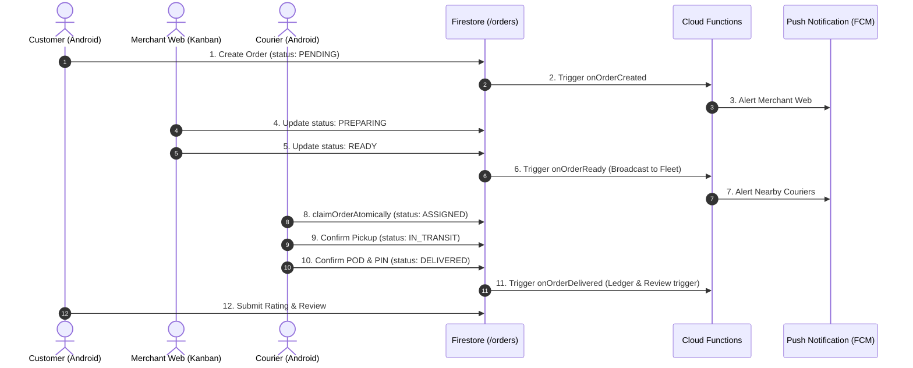

# 12 — COMMERCE DELIVERY FLOW COMPLETE SPECIFICATION

**Domain:** Commerce Delivery (`/orders/{orderId}`)  
**Participating Actors:** Customer App, Merchant Web, Courier App, Cloud Functions  
**Audit Reference:** FLOW-001

---

## 🔄 1. End-to-End Operational Lifecycle

The Commerce Delivery workflow manages orders originating from restaurant menus and merchant storefronts.

---

## 📋 2. Step-by-Step Data State Transitions

1. **Step 1 — Order Placement (`PENDING`):**
   - Customer checkout generates `/orders/{orderId}`.
   - Fields: `customerId`, `businessId`, `branchId`, `items`, `total`, `paymentMethod`, `deliveryAddress`, `status = "PENDING"`.
2. **Step 2 — Merchant Acceptance (`PREPARING`):**
   - Merchant views order on Kanban board, sets estimated prep time (e.g. 20 min).
3. **Step 3 — Order Ready (`READY`):**
   - Merchant marks order as cooked and packed.
   - Order becomes eligible in `FleetPoolScreen` or triggers auto-dispatch.
4. **Step 4 — Courier Assignment (`ASSIGNED`):**
   - Driver executes atomic transaction claiming the order. `assignedCourierId` is locked.
5. **Step 5 — Picked Up (`IN_TRANSIT`):**
   - Driver scans/confirms ticket at restaurant counter. Active navigation starts toward customer.
6. **Step 6 — Delivery Completed (`DELIVERED`):**
   - Customer provides PIN or signs screen. Driver confirms cash received if applicable.
   - Cloud Function logs financial event to `/financial_events`.

---
*Evidence: verified in `functions/src/domain/orders/` and `app/src/main/java/com/example/ui/customer/CheckoutScreen.kt`.*
