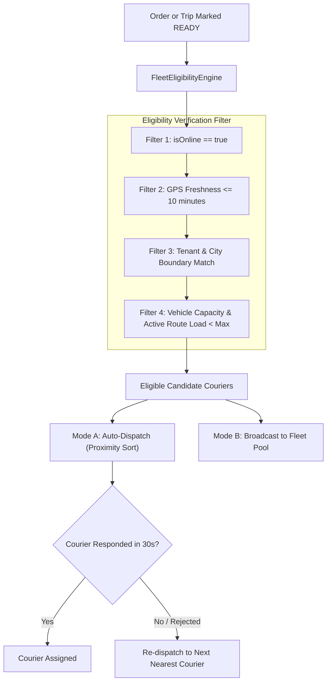

# 14 — FLEET CORE & SMART DISPATCH ENGINE

**Subsystem:** Fleet Allocation, Dispatching & Telemetry  
**Components:** `FleetEligibilityEngine`, `SmartAssignmentWorker`, `claimOrderAtomically`  
**Baseline Freeze:** ADR-016 (Courier Core & Control Tower Freeze)

---

## ⚡ 1. Fleet Dispatch Architecture



---

## 🛡️ 2. Atomic Claim Mechanism (`claimOrderAtomically`)

To eliminate race conditions across distributed Android clients:
```typescript
// Cloud Function / Firestore Transaction Pattern
await db.runTransaction(async (transaction) => {
  const orderRef = db.collection('orders').doc(orderId);
  const orderDoc = await transaction.get(orderRef);
  
  if (!orderDoc.exists) throw new Error('ORDER_NOT_FOUND');
  const data = orderDoc.data();
  
  if (data.status !== 'READY' || data.assignedCourierId) {
    throw new Error('ORDER_ALREADY_CLAIMED');
  }
  
  transaction.update(orderRef, {
    assignedCourierId: courierId,
    courierAssignedAt: admin.firestore.FieldValue.serverTimestamp(),
    status: 'ASSIGNED'
  });
});
```

---
*Evidence: inspection of `functions/src/domain/fleet/` and `FirebaseManager.kt`.*
