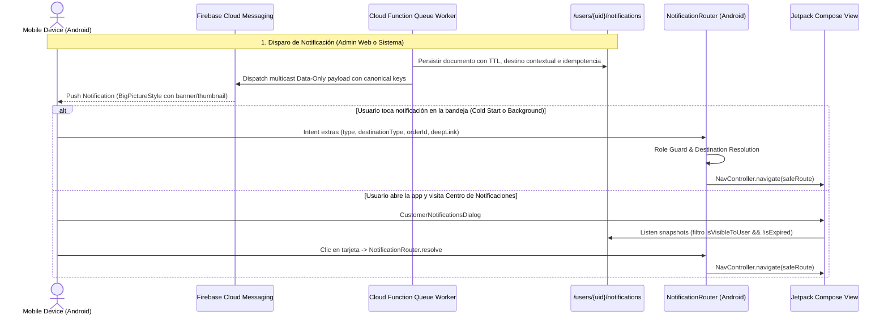

# 21 — FIREBASE CLOUD MESSAGING (FCM) & PUSH NOTIFICATIONS ENTERPRISE

**Subsystem:** Notification Center + FCM Push + Deep Linking + Contextual Navigation (Sprint 18.2)  
**Collections:** `/user_devices/{uid}_{deviceId}`, `/users/{uid}/notifications/{id}`, `/notification_campaigns/{id}`, `/campaign_deliveries/{key}`  
**Backend Trigger / Worker:** `functions/src/triggers/auth.ts`, `functions/src/triggers/orders.ts`, `functions/src/services/notificationQueueWorker.ts`  
**Android Router:** `app/src/main/java/com/example/navigation/NotificationRouter.kt`

---

## 🔔 1. Architecture & Multidevice Lifecycle

---

## 📬 2. Canonical Notification Contract

Todas las notificaciones persisten y transmiten de forma isomórfica el siguiente contrato canónico:

| Campo | Tipo | Descripción | Ejemplo |
|---|---|---|---|
| `destinationType` | `String` | Tipo canónico de destino contextual | `CUSTOMER_ORDER_TRACKING`, `CUSTOMER_PRODUCT` |
| `destinationRoute`| `String` | Ruta interna de Jetpack Compose | `customer/order_tracking/ord_123` |
| `fallbackDestination`| `String` | Ruta segura en caso de error/ausencia | `customer_dashboard` |
| `action` | `String` | Acción semántica | `OPEN_TRACKING`, `OPEN_MERCHANT` |
| `deepLink` | `String` | URI estándar deep link | `bluesystem://customer/order_tracking/ord_123` |
| `entityId` | `String` | Identificador de la entidad | `ord_123`, `biz_roma`, `prod_pizza` |
| `entityType` | `String` | Dominio de la entidad | `ORDER`, `BUSINESS`, `PRODUCT`, `COUPON` |
| `businessId` | `String` | ID del comercio asociado | `biz_roma` |
| `productId` | `String` | ID del producto asociado | `prod_pizza` |
| `couponId` | `String` | Código de cupón | `PROMO30` |
| `imageUrl` | `String` | Banner/Miniatura (Cloud Storage) | `https://firebasestorage.../banner.webp` |
| `expiresAt` | `Timestamp`| Fecha de expiración (TTL) | `now + 72h` (Bienvenida) |

---

## ⏱️ 3. Regla de Integridad de Notificaciones de Bienvenida (72 Horas)

Las notificaciones de bienvenida generadas en el primer registro del cliente (`WELCOME_FIRST_REGISTRATION_V1`):
1. Son generadas en el backend de forma **Server-Authoritative** dentro de `triggers/auth.ts`.
2. Utilizan ID de documento determinista para garantizar **Idempotencia Absoluta** (sin duplicación).
3. Establecen `expiresAt = now + 72 horas`.
4. El método `isExpired()` y la consulta en `NotificationRepository` filtran y descartan notificaciones vencidas para no confundir al usuario días o semanas después.

---

## 🛡️ 4. Role Guards & Fallback Universal

- **Repartidores (Couriers):** Ninguna notificación puede desviar a un repartidor a pantallas exclusivas del cliente como `OrderDetailScreen`. Toda acción operacional redirige estrictamente a `Screen.Courier`.
- **Comercios (Merchants):** Toda notificación comercial redirige al panel de control comercial `business_dashboard`.
- **Zero Dead-Ends:** Si la entidad referenciada (pedido, producto, cupón) fue eliminada o no se encuentra disponible, `NotificationRouter` redirige de forma transparente al Fallback Universal (`customer_dashboard`), garantizando cero pantallas en blanco o bloqueos.
