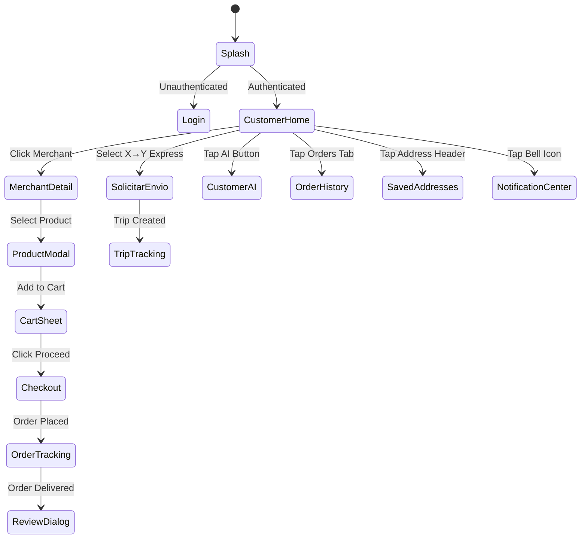
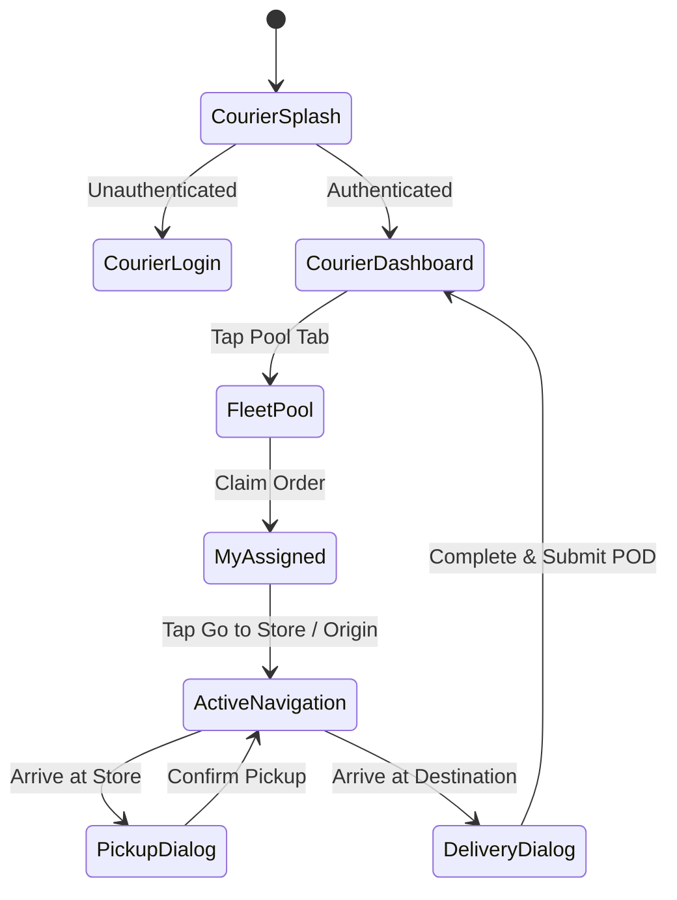

# 28 — COMPREHENSIVE NAVIGATION MAP & DEEP LINKS

**Architecture:** Jetpack Compose Navigation (Android) & React Router / Hash Navigation (Web)  
**Audit Protocol:** BSD-MASTER-PLATFORM-RADIOGRAPHY-UXUI-001  
**Centralized Router:** `app/src/main/java/com/example/navigation/NotificationRouter.kt`

---

## 🗺️ 1. Customer Android Navigation Graph

---

## 🔔 2. Notification Deep Linking & Contextual Routing Matrix

| Destination Type | Trigger Event / Context | Resolved Compose Route | Canonical URI Scheme |
|---|---|---|---|
| `CUSTOMER_HOME` | Bienvenida / Apertura / Promo general | `customer_dashboard` | `bluesystem://customer/home` |
| `CUSTOMER_ORDER_TRACKING`| Pedido en camino / recolectado / repartidor llegando | `customer/order_tracking/{orderId}` | `bluesystem://orders/{orderId}/tracking` |
| `CUSTOMER_ORDER_DETAIL` | Pedido creado / preparando / entregado / cancelado | `order_detail/{orderId}` | `bluesystem://orders/{orderId}` |
| `CUSTOMER_ORDERS` | Recordatorio / Historial de pedidos | `orders_history` | `bluesystem://customer/orders` |
| `CUSTOMER_PRODUCT` | Promoción de plato o producto específico | `comercio_detalle_screen/{bizId}?productId={prodId}` | `bluesystem://merchant/{bizId}/product/{prodId}` |
| `CUSTOMER_MERCHANT` | Nuevo comercio / Recomendación de tienda | `comercio_detalle_screen/{bizId}` | `bluesystem://merchant/{bizId}` |
| `CUSTOMER_COUPON` | Cupón otorgado / Descuento disponible | `customer_coupons?couponId={couponId}` | `bluesystem://coupon/{couponId}` |
| `CUSTOMER_SUPPORT_CHAT`| Respuesta de soporte / Actualización de ticket | `customer_help?conversationId={convId}` | `bluesystem://support/{convId}` |
| `COURIER_FLEET_POOL` | Nueva orden lista / oferta de viaje X→Y | `courier` (Role Guard enforced) | `bluesystem://courier/fleet_pool` |
| `MERCHANT_ORDERS` | Nuevo pedido entrante | `business_dashboard` (Role Guard) | `bluesystem://merchant/orders` |

---

## 🛵 3. Courier Android Navigation Graph

---
*Evidence: source code analysis of `app/src/main/java/com/example/navigation/NotificationRouter.kt`, `app/src/main/java/com/example/MainActivity.kt`, and `app/src/main/java/com/example/presentation/customer/profile/CustomerNotificationsDialog.kt`.*
