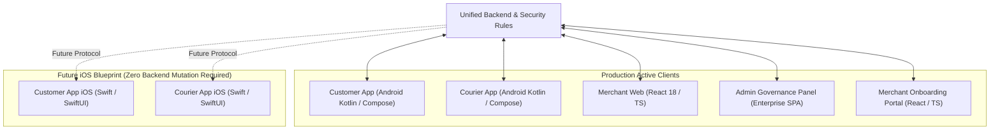

# 34 — CROSS-PLATFORM COHESION & FUTURE IOS READINESS

**Current State:** Dual Android Native (Customer & Courier) + Web (Merchant, Admin, Onboarding)  
**Future Readiness:** iOS Customer & Courier Blueprint

---

## 📱 1. Platform Topology

---

## 🍏 2. iOS Readiness & Reusable Backend Contracts

The backend requires **zero mutations** to support future iOS clients:
1. **Firestore Schemas:** The 98 Firestore collections and documents use platform-agnostic JSON schemas fully compatible with Swift `Codable`.
2. **Authentication:** Firebase Auth and Custom Claims work identically on iOS via Apple Sign-In and Google Sign-In.
3. **Push Notifications:** Cloud Functions use Firebase Admin SDK `sendEachForMulticast`, which natively translates FCM payloads to APNs (Apple Push Notification service).
4. **GPS Telemetry:** `CLLocationManager` on iOS can publish directly to `/ubicaciones_repartidores/{courierId}` using the identical 5s/60s frequency model.

---
*Evidence: architectural blueprint analysis.*
