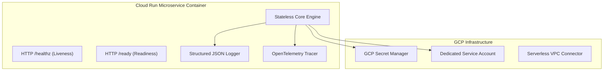

# Google Cloud Run Microservices Architecture Blueprint
**BlueSystem Delivery Enterprise Platform**  
*Sprint 17.1.2 Enterprise Evolution*

---

## 1. Directivas Obligatorias para Microservicios Cloud Run

Todo nuevo microservicio desplegado en **Google Cloud Run** en los Sprints 17.2 en adelante deberá cumplir incondicionalmente con los siguientes 9 mandamientos de arquitectura:

---

## 2. Los 9 Mandamientos de Cloud Run

1. **Stateless (Sin Estado):** Prohibido guardar sesión, archivos persistentes o estado en disco local. Toda persistencia debe delegarse a Firestore, Redis o Storage.
2. **Protocolos Estándar:** Exposición exclusiva mediante REST JSON (OpenAPI v3) o gRPC sobre HTTP/2.
3. **Health & Liveness Probes:**
   - Endpoint `/healthz`: Retorna `HTTP 200 OK` si el proceso está vivo.
   - Endpoint `/ready`: Retorna `HTTP 200 OK` si las conexiones a Firestore y Secret Manager están listas.
4. **Structured Logging:** Emisión de logs en stdout/stderr siguiendo la especificación JSON estructurada Enterprise de `Logger`.
5. **Secret Manager Integration:** Lectura obligatoria de secretos mediante `SecretService` de Secret Manager.
6. **Dedicated IAM Service Account:** Cada microservicio debe ejecutarse con una Service Account exclusiva (ej. `sa-dispatch@bluesystem-7c9af.iam.gserviceaccount.com`) otorgando el principio de menor privilegio.
7. **OpenTelemetry Tracing:** Extracción e inyección del header W3C `traceparent` en todas las peticiones entrantes y salientes.
8. **API Versioning:** Exposición de endpoints bajo prefijo explícito `/v1/`, `/v2/`.
9. **Graceful Shutdown:** Captura de señales `SIGTERM` / `SIGINT` cerrando conexiones activas en menos de 10 segundos.
