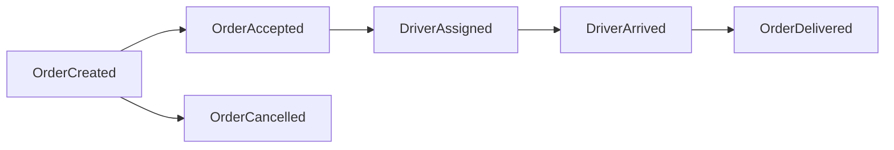

# Domain Events Catalog & Event Driven Specification
**BlueSystem Delivery Enterprise Platform**  
*Sprint 17.1.2 Enterprise Evolution*

---

## 1. Catálogo Oficial de Eventos de Dominio

Los eventos de dominio representan hechos inmutables de negocio que han ocurrido en la plataforma. Servirán como mecanismo principal de desacoplamiento entre Cloud Functions, Cloud Run y la base de datos Firestore.



---

## 2. Definición Estructurada de Eventos Core

### 1. `OrderCreated_v1`
- **Emisor:** App Cliente / API Checkout.
- **Payload Schema:**
  ```typescript
  interface OrderCreatedEvent_v1 {
    eventId: string;
    eventType: "OrderCreated_v1";
    timestamp: string;
    traceId: string;
    orderId: string;
    customerId: string;
    businessId: string;
    totalAmount: number;
    destinationAddress: {
      street: string;
      lat: number;
      lng: number;
    };
  }
  ```

### 2. `OrderAccepted_v1`
- **Emisor:** Merchant Web Portal / KDS Engine.
- **Payload:** `orderId`, `businessId`, `estimatedPreparationMinutes`.

### 3. `DriverAssigned_v1`
- **Emisor:** `bluesystem-dispatch-service` (Cloud Run).
- **Payload:** `orderId`, `driverId`, `driverName`, `vehicleType`, `etaMinutes`.

### 4. `DriverArrived_v1`
- **Emisor:** App Motorizado (Courier).
- **Payload:** `orderId`, `driverId`, `arrivedAtLocation`: `"merchant" | "customer"`.

### 5. `OrderDelivered_v1`
- **Emisor:** App Motorizado / OTP Verification.
- **Payload:** `orderId`, `customerId`, `deliveredAt`, `confirmationMethod`.

### 6. `OrderCancelled_v1`
- **Emisor:** Cliente / Comercio / Sistema.
- **Payload:** `orderId`, `cancelledBy`, `cancellationReason`.

### 7. `PaymentVerified_v1`
- **Emisor:** Cloud Function `onPaymentStatusUpdated` / Pasarela de Pagos.
- **Payload:** `orderId`, `paymentId`, `amountVerified`, `verifiedBy`.
