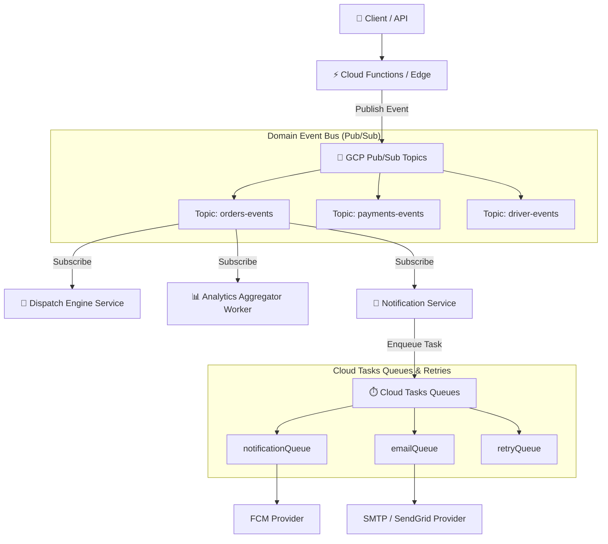

# Event-Driven Messaging & Cloud Tasks Specification
**BlueSystem Delivery Enterprise Platform**  
*Sprint 17.2 Cloud Run & Messaging Foundation*

---

## 1. Arquitectura de Mensajería Asíncrona (Pub/Sub + Cloud Tasks)

Para desacoplar completamente los microservicios y evitar llamadas HTTP directas bloqueantes entre servicios, la plataforma implementa una arquitectura **Event-Driven respaldada por Google Cloud Pub/Sub y Cloud Tasks**.

---

## 2. Inventario de Tópicos Pub/Sub & Subscripciones

| Tópico Pub/Sub | Tipo de Eventos | Subscriptores (Push Subscriptions) | Dead Letter Queue (DLQ) |
| :--- | :--- | :--- | :--- |
| `orders-events` | `OrderCreated`, `OrderAccepted`, `OrderCancelled` | `dispatch-engine`, `analytics-aggregator`, `notification-service` | `orders-events-dlq` |
| `driver-events` | `DriverAssigned`, `DriverArrived`, `OrderDelivered` | `analytics-aggregator`, `notification-service` | `driver-events-dlq` |
| `payments-events` | `PaymentVerified`, `PaymentFailed` | `notification-service`, `analytics-aggregator` | `payments-events-dlq` |
| `merchant-events` | `MerchantApproved` | `notification-service`, `eiam-identity-service` | `merchant-events-dlq` |

---

## 3. Inventario de Colas de Cloud Tasks (Reintentos & Asincronismo)

1. `notificationQueue`: Cola de envío transaccional de notificaciones Push FCM (Reintentos con Backoff Exponencial).
2. `emailQueue`: Cola asíncrona para envío de correos de confirmación y factura.
3. `paymentQueue`: Procesamiento asíncrono de webhooks de pago y reconciliación.
4. `retryQueue`: Cola general de re-intentos para fallos temporales de red downstream.
