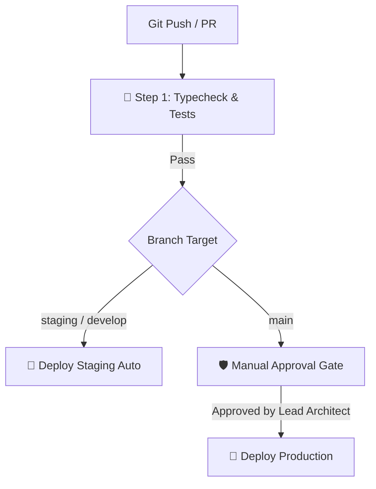

# CI/CD Pipeline & Deployment Guide
**BlueSystem Delivery Enterprise Platform**  
*Sprint 17.1.1 Production Readiness*

---

## 1. Arquitectura del Pipeline de Integración y Despliegue Continuo

El pipeline CI/CD de BlueSystem Delivery está automatizado mediante GitHub Actions (`.github/workflows/backend-ci-cd.yml`), eliminando despliegues manuales y garantizando la certificación previa de calidad.

---

## 2. Etapas del Pipeline

1. **`validate_and_test`:**
   - Instalación reproducible (`npm ci`).
   - Compilación estricta de TypeScript (`npm run build`).
   - Ejecución de pruebas unitarias.
2. **`deploy_staging`:**
   - Despliegue automático ante commits en `staging` o `develop`.
   - Utiliza la Service Account staging de Firebase.
3. **`deploy_production`:**
   - Requiere merge a la rama `main`.
   - **Compuerta de Aprobación Manual (Manual Approval Gate):** Exige aprobación explícita del Lead Architect / Auditor en la consola de GitHub Environment (`production`).
