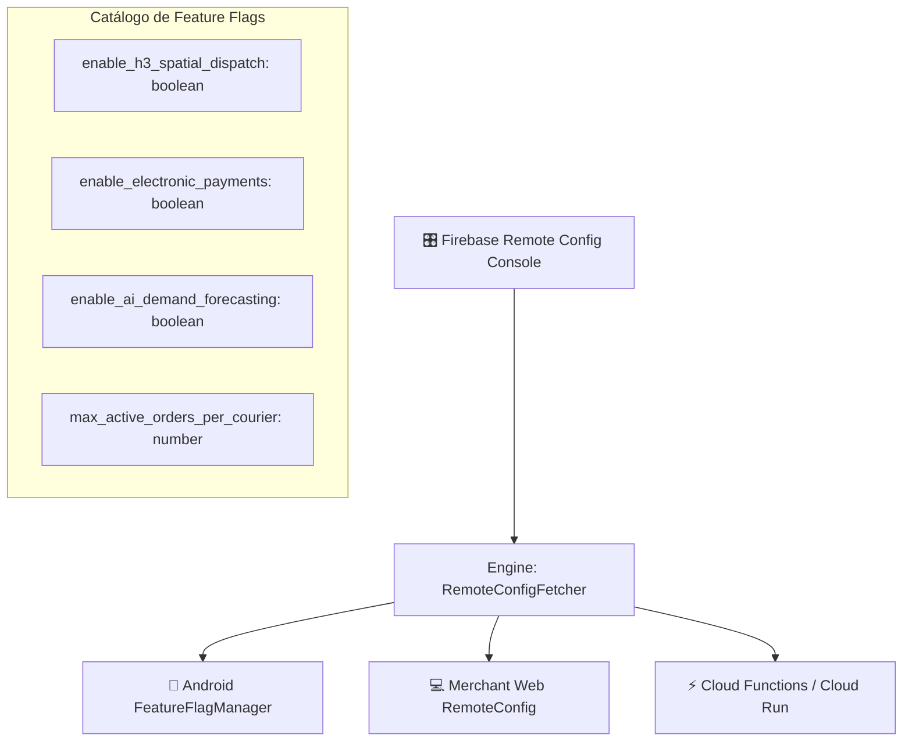

# Feature Flags Engine Specification & Rollout Strategy
**BlueSystem Delivery Enterprise Platform**  
*Sprint 17.1.2 Enterprise Evolution*

---

## 1. Arquitectura de Banderas Dinámicas (Remote Config)

BlueSystem Delivery utiliza **Firebase Remote Config** y el cliente unificado `FeatureFlagEngine` para habilitar características de forma progresiva, realizar pruebas A/B y disponer de Interruptores de Emergencia (Kill-switches operacionales) sin necesidad de redesplegar artefactos.

---

## 2. Catálogo Oficial de Feature Flags

| Nombre de la Bandera | Tipo | Valor Default | Descripción / Propósito |
| :--- | :--- | :--- | :--- |
| `enable_h3_spatial_dispatch` | `boolean` | `false` | Activa el nuevo algoritmo de despacho en tiempo real sobre Cloud Run. |
| `enable_electronic_payments` | `boolean` | `false` | Habilita pasarelas de pago electrónico en cliente (Stripe / Mercado Pago). |
| `enable_ai_demand_forecasting` | `boolean` | `false` | Habilita proyecciones de demanda asistidas por IA para comercios Enterprise. |
| `max_active_orders_per_courier` | `number` | `2` | Número máximo de pedidos simultáneos asignables a un motorizado. |
| `killswitch_push_notifications` | `boolean` | `false` | **Kill-switch:** Desactiva temporalmente campañas masivas FCM ante picos. |

---

## 3. Estrategia de Despliegue Progresivo (Canary Rollouts)

1. **Fase 1 (Internal Alpha 10%):** Habilitación únicamente para usuarios con Custom Claim `role == 'AUDITOR'` o `role == 'SUPER_ADMIN'`.
2. **Fase 2 (Canary 25%):** Despliegue segmentado por porcentaje de usuarios aleatorios.
3. **Fase 3 (General Availability 100%):** Habilitación global tras verificar 0 violaciones de SLO/SLA.
