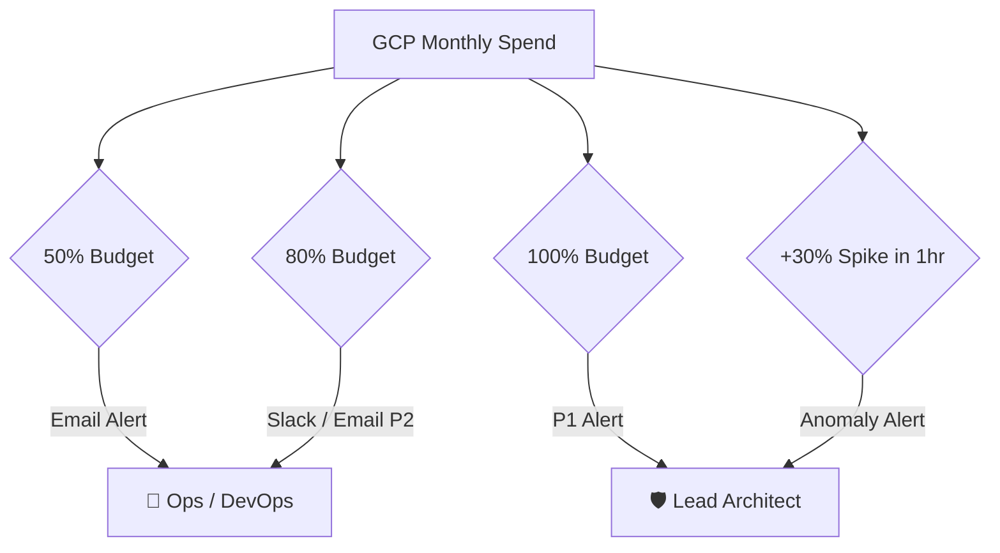

# GCP Budget & Cost Alerts Configuration Guide
**BlueSystem Delivery Enterprise Platform**  
*Sprint 17.1.1 Production Readiness*

---

## 1. Estrategia de Control de Presupuesto

Para evitar sorpresas de facturación y detectar anomalías de consumo de forma temprana, se establecen políticas de presupuesto gestionadas en Google Cloud Billing.

---

## 2. Umbrales de Alerta Configurados

1. **Alerta 50% de Presupuesto Mensual:** Notificación informativa por correo electrónico al equipo DevOps.
2. **Alerta 80% de Presupuesto Mensual:** Notificación de prioridad P2 en canal Slack `#ops-billing-alerts`.
3. **Alerta 100% de Presupuesto Mensual:** Alerta de prioridad P1 exigiendo revisión inmediata de cuotas e índices.
4. **Alerta de Anomalia por Pico Spikes:** Disparada automáticamente si un servicio individual (Firestore Reads, Maps API o Cloud Functions) sufre un incremento mayor al $30\%$ de consumo por hora.

---

## 3. Presupuestos por Servicio Mínimos

- **Firestore Database:** Limite máximo de lecturas diarias indexadas.
- **Google Maps Platform:** Cuota máxima por día para Places Autocomplete y Directions API.
- **Cloud Functions / Cloud Run:** Límite máximo de instancias concurrentes y tiempo de cómputo vCPU/RAM.
