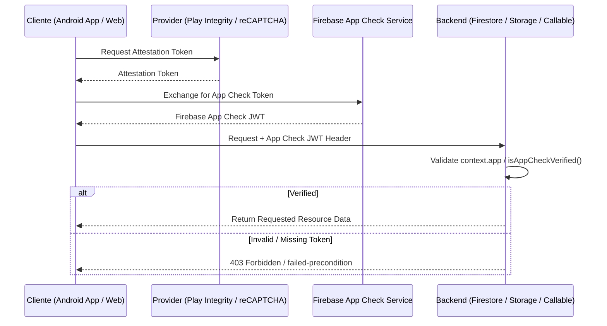

# Firebase App Check Security & Integration Guide
**BlueSystem Delivery Enterprise Platform**  
*Sprint 17.1 Infrastructure Foundation*

---

## 1. Estrategia de Atestación de Integridad

Firebase App Check protege los recursos del backend (Firestore, Storage, Cloud Functions) garantizando que solo solicitudes provenientes de clientes oficiales atestados (Android Play Integrity API y Web reCAPTCHA Enterprise) puedan interactuar con la plataforma.



---

## 2. Configuración por Plataforma

### 📱 App Android (Play Integrity API)
1. **Atribución en Firebase Console:** Habilitar Play Integrity API en Firebase Console -> App Check.
2. **Inicialización SDK Android (Kotlin):**
   ```kotlin
   FirebaseApp.initializeApp(context)
   val firebaseAppCheck = FirebaseAppCheck.getInstance()
   firebaseAppCheck.installAppCheckProviderFactory(
       PlayIntegrityAppCheckProviderFactory.getInstance()
   )
   ```

### 💻 Web (reCAPTCHA Enterprise)
1. **Atribución:** Habilitar reCAPTCHA Enterprise en GCP / Firebase Console.
2. **Inicialización Web (JS/TS):**
   ```typescript
   import { initializeAppCheck, ReCaptchaEnterpriseProvider } from "firebase/app-check";

   const appCheck = initializeAppCheck(app, {
     provider: new ReCaptchaEnterpriseProvider('SITE_KEY'),
     isTokenAutoRefreshEnabled: true
   });
   ```

---

## 3. Reglas de Validación en Backend

### 1. Cloud Functions Callables:
Validado automáticamente mediante middleware en `functions/src/shared/middleware/validator.ts`:
```typescript
if (options.requireAppCheck && process.env.NODE_ENV === "production" && !context.app) {
  throw new functions.https.HttpsError("failed-precondition", "App Check: Solicitud rechazada.");
}
```

### 2. Firestore & Storage Rules:
Helper `isAppCheckVerified()` aplicado en `firestore.rules` y `storage.rules`:
```firestore
function isAppCheckVerified() {
  return request.auth != null && (request.auth.token.firebase.get("app_check", false) == true || request.auth.token.get("app_check", false) == true);
}
```
