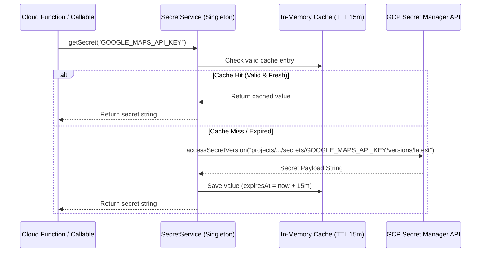

# Secret Management & Security Policy
**BlueSystem Delivery Enterprise Platform**  
*Sprint 17.1 Infrastructure Foundation*

---

## 1. Regla Inviolable de Seguridad
Queda **estrictamente prohibido** almacenar secretos o credenciales sensibles en el código fuente, repositorios Git, o como variables planas de entorno (`process.env.API_KEY`) en producción.

---

## 2. Integración de Google Cloud Secret Manager

Todos los secretos de producción y staging son administrados centralizadamente mediante **Google Cloud Secret Manager** y accedidos dinámicamente mediante el servicio `SecretService` (`functions/src/config/secretManager.ts`).

### Secretos Mínimos Certificados:
1. `GOOGLE_MAPS_API_KEY`: Clave de API para Routes, Places y Geocoding.
2. `FCM_SERVER_KEY`: Clave de servidor para Firebase Cloud Messaging v1.
3. `TWILIO_ACCOUNT_SID`: SID de cuenta Twilio para verificación SMS.
4. `TWILIO_AUTH_TOKEN`: Auth Token de Twilio.
5. `SMTP_API_KEY`: API Key para servicio SMTP transaccional.
6. `JWT_SIGNING_SECRET`: Secreto HMAC para firma de tokens JWT internos.
7. `PAYMENT_SECRET`: Clave secreta para firmas webhook de pasarelas de pago.
8. `APP_SIGNATURE`: Firma criptográfica de atestación de aplicación cliente.

---

## 3. Arquitectura del Servicio `SecretService`

### Características Clave:
- **Cache en Memoria con TTL (15 min):** Minimiza llamadas a la API de Secret Manager evitando sobrecostos y latencias innecesarias.
- **Deduplicación de Peticiones:** Si múltiples peticiones concurrentes solicitan el mismo secreto, se ejecuta una sola llamada de red (`inFlightPromises`).
- **Fail-Fast Exception:** Si un secreto requerido no existe en el Secret Manager ni en el fallback de entorno, se lanza una excepción estricta inmediatamente.
