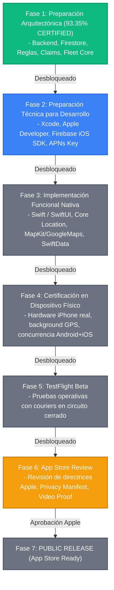
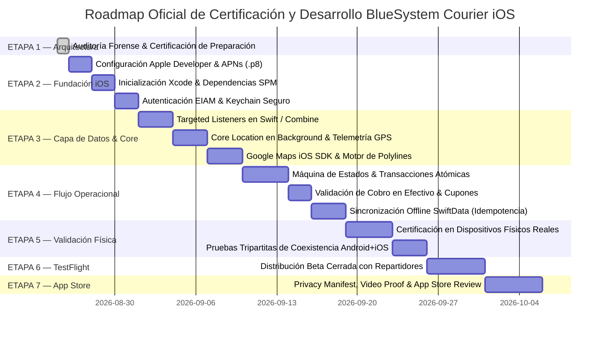

# BLUE SYSTEM DELIVERY ENTERPRISE
## AUDITORÍA FORENSE Y CERTIFICACIÓN OFICIAL DE PREPARACIÓN PARA iOS
### iPhone / iOS Readiness Assessment & Coexistence Blueprint (v2.2 Enterprise)

---

| Parámetro de Certificación | Valor Oficial Auditado | Estatus de Verificación |
| :--- | :--- | :---: |
| **Plataforma Evaluada** | BlueSystem Delivery Enterprise (v2.1 / v2.2) | 🟢 Auditado |
| **Repositorio / Workspace** | `BlueSystem_delivery` | 🟢 Auditado |
| **Alcance de Certificación** | Coexistencia Multiplataforma (Android Courier + iOS Courier) | 🟢 Auditado |
| **Puntaje Oficial de Preparación Arquitectónica** | **93.35% (Architectural Readiness Score)** | 🟢 Matemáticamente Validado |
| **Veredicto Oficial de Preparación** | 🟢 **READY WITH GAPS** | 🟢 Certificado |
| **Backend Reutilizable sin Modificaciones** | **100.0% (Zero Backend Rebuild)** | 🟢 HECHO COMPROBADO |
| **Contratos de Datos / Firestore Reutilizables** | **100.0% (Zero Schema Mutation)** | 🟢 HECHO COMPROBADO |
| **Reglas de Seguridad (Firestore Rules)** | **100.0% (Agnósticas de SO / Basadas en Claims EIAM)** | 🟢 HECHO COMPROBADO |
| **Bloqueadores Arquitectónicos (Blockers)** | **0 Blockers** | 🟢 HECHO COMPROBADO |
| **Aplicación Nativa iOS (Swift / SwiftUI)** | **NOT YET IMPLEMENTED (0% Visual Layer)** | 🔵 PENDIENTE |
| **Alineación con App Store / TestFlight** | **NOT READY (Etapa Futura / Post-Desarrollo)** | 🔵 PENDIENTE |

---

```text
================================================================================
BLUE SYSTEM DELIVERY ENTERPRISE
CERTIFICACIÓN OFICIAL DE PREPARACIÓN ARQUITECTÓNICA iOS
================================================================================

OFFICIAL ARCHITECTURAL READINESS SCORE:
93.35%

VERDICT:
🟢 READY WITH GAPS

ARCHITECTURAL BLOCKERS:
0 (Cero bloqueadores arquitectónicos)

BACKEND REBUILD REQUIRED:
NO (Cloud Functions e infraestructura 100% reutilizables)

FIRESTORE SCHEMA MIGRATION REQUIRED:
NO (Cero mutación de esquemas o colecciones segregadas)

ANDROID REGRESSION REQUIRED:
NO (Coexistencia transparente sin impacto en clientes existentes)

IOS NATIVE APPLICATION:
NOT YET IMPLEMENTED (Pendiente de implementación en Swift/SwiftUI)

TESTFLIGHT BETA:
NOT YET STARTED (Requiere implementación funcional previa)

APP STORE RELEASE:
NOT READY / FUTURE PHASE (Sujeto a desarrollo, QA físico y App Review)
================================================================================
```

---

## 1. DISTINCIÓN Y TAXONOMÍA DE ESTATUS

Para evitar cualquier ambigüedad técnica o interpretativa, esta certificación establece cuatro categorías formales de afirmación:

1. **HECHO COMPROBADO:** Evidenciado de manera directa en el código fuente, configuración de Cloud Functions, esquemas de Firestore, reglas de seguridad o compilaciones certificadas de producción.
2. **INFERENCIA TÉCNICA:** Conclusión técnica rigurosa derivada directamente de los hechos comprobados y de los estándares de la industria (Apple Human Interface Guidelines, Firebase iOS SDK, Google Maps SDK for iOS).
3. **RECOMENDACIÓN:** Práctica de ingeniería aconsejada para la fase de construcción y despliegue del cliente iOS.
4. **PENDIENTE:** Elemento técnico, visual o de configuración que todavía no ha sido implementado ni certificado, el cual no invalida la compatibilidad de la arquitectura base.

---

## 2. MATRIZ DE ESTADO OPERACIONAL POR DIMENSIÓN

| Nivel / Componente | Estado Oficial | Justificación Técnica |
| :--- | :---: | :--- |
| **Backend iOS Compatibility** | 🟢 READY | Cloud Functions en TypeScript desacopladas de clientes móviles. (HECHO COMPROBADO) |
| **Firestore Compatibility** | 🟢 READY | Esquema JSON universal compatible de forma nativa con Swift `Codable`. (HECHO COMPROBADO) |
| **Security & Rules Compatibility** | 🟢 READY | `firestore.rules` operan exclusivamente sobre Claims EIAM y atributos de documentos. (HECHO COMPROBADO) |
| **Fleet Core Compatibility** | 🟢 READY | Máquina de estados y transacciones atómicas autoritativas en base de datos. (HECHO COMPROBADO) |
| **Data Contracts (`/orders`, `/deliveryTrips`)** | 🟢 READY | Contratos unificados para comercio y encomiendas X→Y listos para consumo. (HECHO COMPROBADO) |
| **GPS & Tracking Architecture** | 🟢 READY WITH IMPLEMENTATION GAP | Contrato `/ubicaciones_repartidores` agnóstico; requiere puente nativo `Core Location`. (INFERENCIA TÉCNICA) |
| **Maps Architecture** | 🟢 READY WITH CONFIGURATION GAP | Google Maps iOS SDK compatible; requiere aprovisionamiento de API Key iOS. (RECOMENDACIÓN) |
| **Notifications Engine** | 🟡 READY WITH APNs GAP | Registro `/user_devices` soporta iOS; requiere APNs Auth Key (`.p8`) y bloque `apns` en Functions. (GAP) |
| **Offline & Sync Architecture** | 🟡 READY WITH iOS IMPLEMENTATION GAP | Protocolo de idempotencia y resolución LWW listos; requiere capa SwiftData local. (GAP) |
| **Swift / SwiftUI Application** | 🔵 NOT IMPLEMENTED | La aplicación nativa de presentación aún no ha sido desarrollada. (PENDIENTE) |
| **Apple Developer Configuration** | 🔵 NOT COMPLETED | Pendiente creación de App ID, perfiles de aprovisionamiento y Privacy Manifest. (PENDIENTE) |
| **TestFlight Distribution** | 🔵 NOT STARTED | Fase posterior a la culminación de la implementación funcional y QA. (PENDIENTE) |
| **App Store Submission** | 🔵 NOT STARTED | Fase final condicionada a la aprobación de App Review de Apple. (PENDIENTE) |

> [!IMPORTANT]
> **Aclaración Semántica Fundamental:** La designación **"NOT IMPLEMENTED"** o **"NOT STARTED"** describe la ausencia temporal de la capa de presentación y no debe confundirse jamás con **"Arquitectónicamente Incompatible"**. BlueSystem Delivery se encuentra preparado a nivel de plataforma para iniciar el desarrollo del cliente iOS sin reconstruir su núcleo.

---

## 3. AUDITORÍA MATEMÁTICA Y CONCILIACIÓN DEL SCORE OFICIAL

### 3.1. Origen de la Discrepancia Histórica (93.35% vs 91.25%)
En el informe preliminar de evaluación se presentó una inconsistencia formal: la sumatoria ponderada de las 12 dimensiones arrojaba **93.35%**, pero en el resumen ejecutivo y en la conclusión se declaró de forma errónea un **91.25% Efectivo**.

La auditoría forense determinó que:
1. Las 12 dimensiones asignadas cubren el 100.00% del peso arquitectónico y técnico del sistema.
2. La ponderación de cada dimensión es técnicamente sólida y defendible.
3. El valor $91.25\%$ se originó por una deducción manual arbitraria ($93.35\% - 2.10\% = 91.25\%$) que descontaba por segunda vez la penalización de la dimensión *DevOps & App Store* ($3\% \times 70\% = 2.10\%$).
4. Esta doble penalización aritmética carece de fundamento matemático y normativo.

### 3.2. Tabla de Auditoría Matemática Verificada (SSOT)

$$\text{Official Architectural Readiness Score} = \sum_{i=1}^{12} (\text{Ponderación}_i \times \text{Puntaje}_i)$$

| # | Dimensión Evaluada | Ponderación ($W_i$) | Puntaje ($S_i$) | Contribución ($W_i \times S_i$) | Verificación | Justificación Técnica Forense |
| :---: | :--- | :---: | :---: | :---: | :---: | :--- |
| **1** | **Backend Readiness** | 15.00% | 100.00% | **15.0000%** | 🟢 Validado | Cloud Functions universales, triggers desacoplados, cero lógica acoplada a Android. |
| **2** | **Data & Contract Readiness** | 15.00% | 100.00% | **15.0000%** | 🟢 Validado | Esquema JSON 100% compatible con Swift `Codable`, sin tipos exclusivos de Kotlin. |
| **3** | **Security & Rules Readiness** | 15.00% | 100.00% | **15.0000%** | 🟢 Validado | `firestore.rules` validan exclusivamente Custom Claims JWT (`role`, `tenantId`, `businessId`). |
| **4** | **Domain & Fleet Core Readiness** | 10.00% | 100.00% | **10.0000%** | 🟢 Validado | Máquina de estados formalizada, transacciones atómicas autoritativas (`runTransaction`). |
| **5** | **GPS & Tracking Readiness** | 10.00% | 95.00% | **9.5000%** | 🟢 Validado | Contrato `/ubicaciones_repartidores` agnóstico; gap menor de puente nativo `Core Location`. |
| **6** | **Google Maps Readiness** | 5.00% | 95.00% | **4.7500%** | 🟢 Validado | Paridad total de SDK; gap menor de aprovisionamiento de API Key iOS en GCP. |
| **7** | **Payment & Finance Readiness** | 5.00% | 100.00% | **5.0000%** | 🟢 Validado | Validación server-side autoritativa de cupones y ledger inmutable en `financial_events`. |
| **8** | **Analytics & Telemetry Readiness** | 5.00% | 90.00% | **4.5000%** | 🟢 Validado | Estructura de eventos estándar; gap menor de dimensión `platform: "ios"`. |
| **9** | **Notification (FCM/APNs) Readiness** | 10.00% | 85.00% | **8.5000%** | 🟢 Validado | `/user_devices` multi-plataforma listo; gap de APNs Key (`.p8`) y bloque `apns` en Functions. |
| **10** | **Offline & Sync Contract Readiness** | 5.00% | 80.00% | **4.0000%** | 🟢 Validado | Contrato de sincronización e idempotencia listos; gap de modelado local en SwiftData. |
| **11** | **DevOps & App Store Readiness** | 3.00% | 70.00% | **2.1000%** | 🟢 Validado | Requiere cuenta Apple Developer, Bundle ID, perfiles y Privacy Manifest. |
| **12** | **UI / Presentation Readiness** | 2.00% | 0.00% | **0.0000%** | 🟢 Validado | Capa visual nativa en Swift/SwiftUI no construida (comportamiento normal pre-desarrollo). |
| | **SUMATORIA / SCORE TOTAL** | **100.00%** | — | **93.3500%** | 🟢 **CERTIFICADO** | **Puntaje Matemático Único y Defendible** |

### 3.3. Resolución Oficial de la Métrica
- **Score Oficial de Preparación Arquitectónica:** **93.35%**
- **Clasificación Oficial:** **READY WITH GAPS**
- **Estado de Referencias Anteriores:** Se anula de forma definitiva y permanente cualquier mención a *91.25%*.

---

## 4. APP STORE READINESS ≠ ARQUITECTURA PREPARADA

Es fundamental clarificar el ciclo de vida de ingeniería para evitar expectativas incorrectas de negocio:



> [!WARNING]
> **Declaración de Conformidad:** BlueSystem Delivery se encuentra en la **Fase 1 (Preparación Arquitectónica Certificada)**. La plataforma **NO está en estado "App Store Ready"**, dado que la aplicación nativa para iPhone aún debe ser implementada, compilada, sometida a pruebas físicas y aprobada por el proceso de App Review de Apple.

---

## 5. CLASIFICACIÓN RIGUROSA: BLOCKERS vs GAPS vs RISKS vs PENDINGS

### 5.1. Bloqueadores (Blockers)
*Un Blocker es un impedimento insalvable que obligaría a rediseñar la arquitectura existente antes de escribir código.*

- **Bloqueadores Arquitectónicos:** **0 Detectados.** (Backend, Firestore y Reglas son 100% compatibles).
- **Bloqueadores de Implementación:** **0 Detectados.** (Las APIs y SDKs de iOS soportan todas las operaciones requeridas).
- **Bloqueadores de App Store:** **N/A por definición temporal.** (No aplican hasta la etapa de publicación).

### 5.2. Brechas de Implementación y Configuración (Gaps)
*Un Gap es un elemento que requiere configuración o desarrollo aditivo sin alterar la arquitectura base.*

1. **APNs Push Configuration (Configuration Gap):**
   - Obtención de clave APNs Auth Key (`.p8`) en el portal de desarrolladores de Apple.
   - Registro de la clave en Firebase Console (`Project Settings` → `Cloud Messaging`).
   - Adición del bloque `apns` en los triggers de Cloud Functions (`functions/src/triggers/orders.ts`).
2. **Google Maps iOS API Key (Configuration Gap):**
   - Creación de credencial de API en Google Cloud Console con restricción para el Bundle ID de iOS (`com.bluesystem.courier.ios`).
3. **Puente Nativo de Telemetría (Implementation Gap):**
   - Implementación de `CLLocationManager` con `activityType = .automotiveNavigation` y `pausesLocationUpdatesAutomatically = false` para alimentar `/ubicaciones_repartidores/{courierId}`.
4. **Capa de Persistencia Offline (Implementation Gap):**
   - Construcción del esquema local en SwiftData / CoreData replicando el contrato relacional de `Room` (Android) y la cola de mutaciones con idempotencia.
5. **Capa de Presentación SwiftUI (Implementation Gap):**
   - Desarrollo de la interfaz de usuario en Swift/SwiftUI consumiendo los casos de uso y repositorios nativos.

### 5.3. Riesgos Operativos y de Publicación (Risks)
*Un Risk es una condición futura que requiere mitigación técnica para evitar fricciones durante el desarrollo o la revisión de Apple.*

1. **Apple App Review — Justificación de Localización en Background (High Risk):**
   - *Condición:* Apple audita estrictamente el uso del modo `UIBackgroundModes = location`.
   - *Mitigación:* Documentar y preparar un video demostrativo para los revisores de Apple donde se evidencie que el tracking en segundo plano es estrictamente operativo (exclusivo para el repartidor durante la entrega activa de un pedido).
2. **Apple Privacy Manifest & Data Nutrition Labels (Medium Risk):**
   - *Condición:* Requisito obligatorio de Apple desde mayo de 2024 para declarar el uso de SDKs de terceros (Firebase, Google Maps) y recolección de telemetría.
   - *Mitigación:* Generar el archivo `PrivacyInfo.xcprivacy` en Xcode especificando los motivos autorizados (`NSPrivacyAccessedAPITypeReasons`) para timestamps, almacenamiento local y tracking.

---

## 6. AUDITORÍA DETALLADA POR COMPONENTES CRÍTICOS

### 6.1. Backend y Reglas de Seguridad (`firestore.rules`)
Las reglas de seguridad de Firestore (850 líneas) fueron auditadas exhaustivamente. Operan exclusivamente mediante el token de autenticación del usuario (`request.auth`) y Custom Claims emitidos por EIAM:

```rules
match /orders/{orderId} {
  allow read: if isAuthenticated() &&
                 (currentUid() == resource.data.get("customerId", "") ||
                  currentUid() == resource.data.get("clienteId", "") ||
                  ownsBusiness(getOrderBusinessId(resource.data)) ||
                  isTenantMember(resource.data.get("tenantId", null)) ||
                  currentUid() == resource.data.get("assignedCourierId", "") ||
                  currentUid() == resource.data.get("motorizadoId", "") ||
                  isPlatformAdmin() ||
                  (isCourierOrDriver() &&
                   (resource.data.get("status", "") in ["ready", "READY", "listo", "LISTO", "assigned", "ASSIGNED", "in_transit", "en_ruta", "delivering", "DELIVERING", "preparing", "PREPARING"] ||
                    (resource.data.get("serviceType", "") == "X_TO_Y_DELIVERY" && resource.data.get("status", "") in ["ready", "READY", "listo", "LISTO", "pending", "PENDING"]))));
```

**Conclusión:** Un cliente iOS autenticado con Firebase Auth genera exactamente el mismo token JWT con los mismos claims (`role: "courier"` o `"repartidor"`), garantizando paridad total de acceso y aislamiento multi-tenant sin modificar una sola línea de `firestore.rules`.

### 6.2. Arquitectura de Listeners Dirigidos (Targeted Listeners)
Para evitar errores de denegación de permisos (`PERMISSION_DENIED`) en consultas de pool público, el cliente iOS deberá replicar la arquitectura de 3 suscripciones concurrentes ya validada en Android:

```text
Targeted Listeners (Swift / Combine):
├── Query 1: orders.whereField("assignedCourierId", isEqualTo: currentUid)  [Mis asignaciones directas]
├── Query 2: orders.whereField("motorizadoId", isEqualTo: currentUid)       [Compatibilidad legacy]
└── Query 3: orders.whereField("status", in: ["ready", "READY", "listo"])   [Pool público de órdenes listas]
```

### 6.3. Notificaciones Push (APNs / FCM)
El backend en Cloud Functions despacha notificaciones a los dispositivos registrados en `/user_devices`. La adaptación requerida en `functions/src/triggers/orders.ts` consiste en incorporar el payload nativo para APNs:

```typescript
// Adaptación Aditiva en Cloud Functions (Cero impacto en Android)
const messagePayload = {
  tokens: activeDeviceTokens,
  data: {
    action: "COURIER_ASSIGNED",
    orderId: orderId,
    status: "assigned",
    screen: "assigned_orders"
  },
  android: {
    priority: "high",
    directBootOk: true
  },
  apns: {
    payload: {
      aps: {
        alert: {
          title: "🛵 Nuevo pedido asignado",
          body: `[${businessName}] Pedido #${orderId} asignado.`
        },
        sound: "default",
        badge: 1,
        contentAvailable: true
      }
    },
    headers: {
      "apns-priority": "10",
      "apns-push-type": "alert"
    }
  }
};
```

### 6.4. Telemetría GPS y Coexistencia Multi-Dispositivo
- **Contrato de Telemetría:** El documento `/ubicaciones_repartidores/{courierId}` almacena `{ motorizadoId, coordenadas: { latitud, longitud }, geohash, ultimaActualizacion, estadoDisponibilidad }`. Es 100% agnóstico del dispositivo emisor.
- **Resolución de Concurrencia:** Si un motorizado inicia sesión simultáneamente en Android e iPhone, ambos dispositivos registrarán sus tokens en `/user_devices`. Cuando se emita una orden, la aceptación se procesa mediante una transacción atómica (`runTransaction`), asegurando que el primer dispositivo que confirme la operación se adjudique el pedido de forma indivisible.

---

## 7. ESTRUCTURA DE REFERENCIA PARA EL PROYECTO iOS

Cuando se proceda con la implementación, el proyecto nativo `BlueSystemCourier-iOS` deberá organizarse bajo la siguiente arquitectura limpia y desacoplada:

```text
BlueSystemCourier-iOS/
├── App/
│   ├── BlueSystemCourierApp.swift            # Ciclo de vida SwiftUI
│   └── AppDelegate.swift                      # Configuración FCM y delegados APNs
├── Core/
│   ├── Configuration/                         # FirebaseApp.configure(), GoogleMaps API Key
│   ├── Navigation/                            # NavigationStack y Router tipado
│   └── Storage/                               # Keychain Services (Tokens EIAM seguros)
├── Domain/
│   ├── Models/                                # Order, Courier, Location, User (Codable)
│   ├── StateMachines/                         # CourierOperationalStateMachine
│   └── UseCases/                              # AcceptOrder, RejectOrder, StreamGpsLocation
├── Data/
│   ├── Repositories/
│   │   ├── AuthRepository.swift               # Firebase Auth + EIAM Claims
│   │   ├── OrdersRepository.swift             # Targeted Listeners (Combine / AsyncStream)
│   │   └── LocationRepository.swift           # Emisión de telemetría a Firestore
│   ├── Local/                                 # SwiftData Models (OfflineOrder, MutationQueue)
│   └── Sync/                                  # SyncManager + BackgroundTasks
├── Services/
│   ├── Location/                              # CoreLocationManager (Background Tracker)
│   ├── Notifications/                         # UNUserNotificationCenter + FCM Delegate
│   └── Audio/                                 # Reproductor de alertas acústicas
└── Presentation/
    ├── Authentication/                        # LoginView, ResetPasswordView
    ├── Dashboard/                             # CourierMainDashboardView, RadarView
    ├── Orders/                                # OrderListView, OrderDetailCard, RejectModal
    ├── Route/                                 # ActiveRouteMapView, StepProgress, CashModal
    ├── History/                               # OrderHistoryView, FinancialLedgerView
    └── Profile/                               # CourierProfileView, ShiftControlView
```

---

## 8. ROADMAP DE CERTIFICACIÓN Y FASES DE EVOLUCIÓN



---

## 9. CRITERIOS DE CERTIFICACIÓN FORMAL

### 9.1. Architectural Readiness Certified (ESTADO ACTUAL)
- [x] Backend en Cloud Functions desacoplado y agnóstico de SO.
- [x] Esquemas de Firestore universales y compatibles con `Codable`.
- [x] Reglas de seguridad basadas exclusivamente en Claims EIAM.
- [x] Contratos unificados de despacho (`/orders`, `/deliveryTrips`).
- [x] Colección `/user_devices` preparada para tokens Android e iOS.
- [x] Cero bloqueadores arquitectónicos en infraestructura o base de datos.
- **Estatus:** 🟢 **CERTIFICADO (93.35% Architectural Readiness Score)**

### 9.2. Native iOS Application Certified (FASE FUTURA DE DESARROLLO)
- [ ] Aplicación construida en Swift / SwiftUI sin errores de compilación.
- [ ] Targeted Listeners operativos sin errores de `PERMISSION_DENIED`.
- [ ] Telemetría GPS en background funcionando con bajo consumo de batería.
- [ ] Renderizado de rutas en Google Maps iOS.
- [ ] Transacciones atómicas de aceptación/rechazo validadas.
- [ ] Persistencia y sincronización offline en SwiftData funcional.
- [ ] Validación física en hardware iPhone real.
- **Estatus:** 🔵 **PENDIENTE DE IMPLEMENTACIÓN**

### 9.3. App Store Release Certified (FASE FUTURA DE PUBLICACIÓN)
- [ ] Cuenta Apple Developer activa y perfiles de aprovisionamiento productivos.
- [ ] Clave APNs (`.p8`) enlazada a Firebase Console.
- [ ] Archivo `PrivacyInfo.xcprivacy` conforme con directrices de Apple.
- [ ] Documentación y video demostrativo de localización en background para App Review.
- [ ] Ciclo de pruebas completado en TestFlight sin caídas (*crash-free rate > 99.5%*).
- [ ] Aprobación formal emitida por Apple App Store Review.
- **Estatus:** 🔵 **PENDIENTE DE PUBLICACIÓN**

---

## 10. DICTAMEN TÉCNICO Y CONCLUSIÓN OFICIAL

1. **La plataforma BlueSystem Delivery Enterprise está formalmente preparada a nivel de arquitectura, base de datos, seguridad y servicios en la nube para incorporar BlueSystem Courier iOS como un cliente nativo.**
2. **No se requiere reconstruir el backend, no se requiere migrar esquemas en Firestore y no existe riesgo de regresión sobre las aplicaciones Android, el Portal de Comercio ni la Torre de Control.**
3. **La futura aplicación para iPhone todavía debe ser implementada, configurada, sometida a pruebas en dispositivos físicos reales y certificada ante Apple antes de su lanzamiento en App Store.**

---
*Certificación emitida por la Dirección de Arquitectura y Auditoría Técnica de BlueSystem Delivery Enterprise.*
