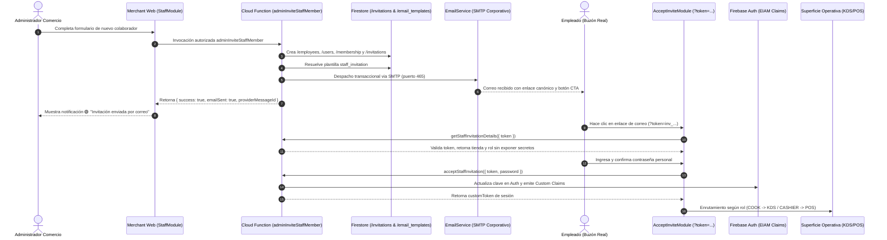

# Walkthrough: Protocolo BSD-MERCHANT-STAFF-INVITATION-EMAIL-DELIVERY-001

## Flujo Secuencial E2E: Envío Real de Invitaciones por Correo y Activación de Cuenta

Este documento describe el flujo operativo verificado de extremo a extremo para la creación de colaboradores, despacho por correo corporativo SMTP, recepción en buzón, aceptación de invitación y activación en el portal comercial.

---

### Diagrama del Flujo de Entrega y Activación



---

### Paso 1. Creación del Colaborador en Merchant Web
- El administrador accede a **Merchant Web → Personal & Staff** y pulsa **"Invitar Colaborador"**.
- Ingresa Nombre, Email, Teléfono, Rol (**COOK**, **CASHIER**, **SUPERVISOR**, **MANAGER**), Sucursal asignada y PIN numérico de estación (4 dígitos).
- Al guardar, el frontend invoca `adminInviteStaffMember`.

### Paso 2. Generación Canónica de la Invitación
- La Cloud Function valida los permisos del administrador en el comercio (`businessId`).
- Crea o vincula la cuenta de identidad en Firebase Auth.
- Genera atómicamente el documento en `/invitations/{token}` con expiración a 72 horas y estado `PENDING`.
- Construye la URL canónica:
  ```text
  https://comercio.bluesystemdelivery.com/accept-invite?token=inv_...
  ```

### Paso 3. Despacho por Correo Corporativo (SMTP Nativo)
- `EmailService.sendTransactionalEmail` resuelve la plantilla oficial `/email_templates/staff_invitation`.
- Inyecta de forma sanitizada y segura las variables:
  - `{{employeeName}}`: Nombre completo del colaborador.
  - `{{businessName}}`: Nombre comercial de la tienda.
  - `{{branchName}}`: Sucursal asignada.
  - `{{roleTitle}}`: Título del rol operativo (ej. *Cocinero / Operador KDS*).
  - `{{email}}`: Correo registrado.
  - `{{activationLink}}`: Enlace HTTPS canónico hacia la pantalla de aceptación.
- Se conecta al servidor corporativo `mail.bluesystemdelivery.com:465` (SSL/TLS nativo) autenticando con credenciales protegidas desde Google Cloud Secret Manager.
- El servidor SMTP acepta el mensaje y retorna el `providerMessageId` (ej. `<ee784336-d58e-38c4-5046-11b69b59b1c2@bluesystemdelivery.com>`).
- Se registra el evento de entrega en `/email_events/{eventId}` con estado `SENT`.

### Paso 4. Retroalimentación en la Interfaz de Merchant Web
- La UI recibe la confirmación y muestra el estado real:
  - 🟢 **Invitación enviada**: Confirmación visual indicando que el correo fue despachado al destinatario.
  - 🔄 **Acción de Reenvío**: Columna de acciones con botón `Mail` que permite reenviar la invitación en cualquier momento mediante `adminResendStaffInvitation` de forma idempotente y sin duplicar empleados ni identidades.

### Paso 5. Recepción y Apertura en el Buzón del Empleado
- El colaborador recibe en su bandeja de entrada un correo con diseño oscuro corporativo BlueSystem Enterprise.
- El mensaje incluye las instrucciones claras de activación: *"Has sido invitado por la administración de [Comercio] para integrarte a su equipo operativo... Activa tu cuenta para comenzar."*
- El correo **NO** expone credenciales ni falsas afirmaciones de que el PIN es la contraseña del portal web.
- Al pulsar el botón **"Activar mi Cuenta"**, el navegador abre:
  ```text
  https://comercio.bluesystemdelivery.com/accept-invite?token=inv_...
  ```

### Paso 6. Validación Segura en `AcceptInviteModule`
- La interfaz detecta el parámetro `?token=` y activa el módulo de aceptación.
- Invoca la función callable autorizada `getStaffInvitationDetails({ token })`.
- Muestra el nombre oficial de la tienda, la sucursal, el rol asignado y el correo del usuario sin exponer tokens ni datos de otros tenants.

### Paso 7. Configuración de Contraseña y Activación EIAM
- El empleado define su contraseña personal (mínimo 6 caracteres) y la confirma.
- La función `acceptStaffInvitation`:
  1. Marca la invitación como `ACCEPTED` con timestamp del servidor.
  2. Actualiza la clave de forma legítima en Firebase Auth (`admin.auth().updateUser`).
  3. Activa la membresía en `/membership` y `/memberships`.
  4. Inyecta los Custom Claims EIAM (`role`, `businessId`, `branchId`, `orgId`, `tenantId`).
  5. Emite un `customToken` firmado.

### Paso 8. Inicio de Sesión y Enrutamiento por Rol
- La pantalla ejecuta `signInWithCustomToken(auth, customToken)`.
- `MerchantContext` carga el contexto multi-tenant de la tienda.
- `useGatekeeper` y `MerchantSurfaceGuard` validan las capacidades:
  - Si el rol es `COOK`: Se habilita la superficie **KDS / Pedidos de Cocina**; se bloquean Finanzas, Personal y Configuración.
  - Si el rol es `CASHIER`: Se habilita la superficie **POS / Mostrador de Pedidos**; se bloquean Finanzas y Personal.
